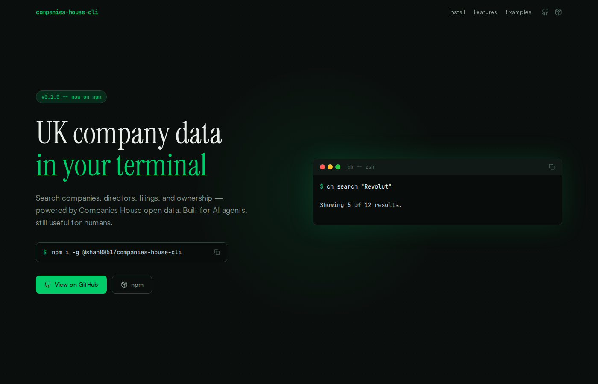
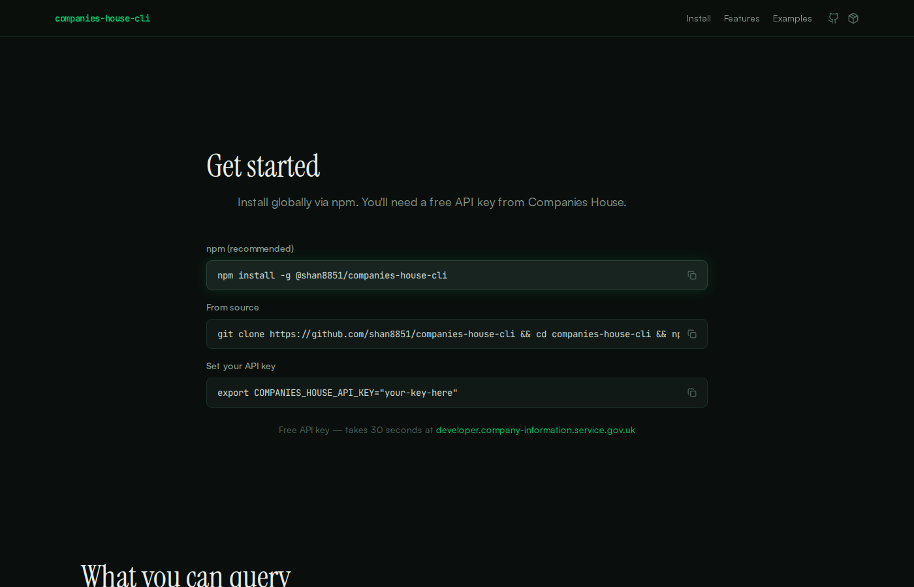
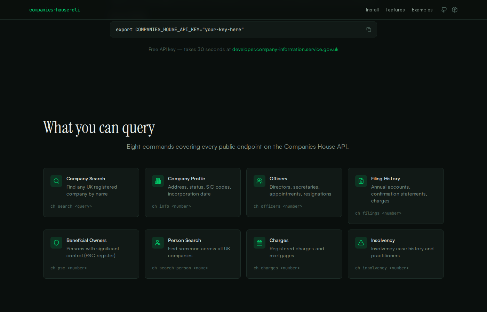
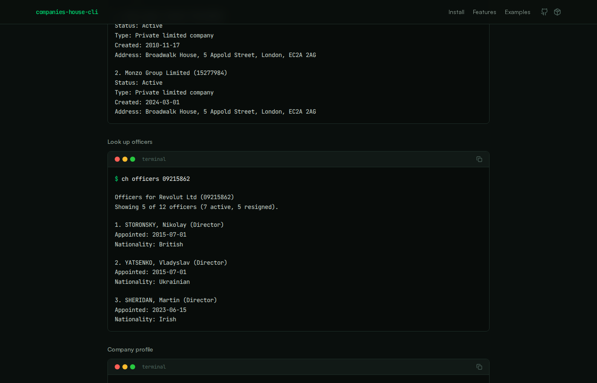

# companies-house-cli-ui

Companion website for [@shan8851/companies-house-cli](https://www.npmjs.com/package/@shan8851/companies-house-cli) — a CLI tool for querying UK Companies House data.

**[ch-cli.xyz](https://ch-cli.xyz)** | **[npm](https://www.npmjs.com/package/@shan8851/companies-house-cli)** | **[CLI source](https://github.com/shan8851/companies-house-cli)**

---



## About

Static single-page site that serves as the landing page and documentation for `companies-house-cli`. Showcases the CLI's features with live terminal examples, install instructions, and agent integration details.

### Install & quickstart



### Feature grid

Eight commands covering every public Companies House API endpoint — company search, profiles, officers, filings, PSC register, person search, charges, and insolvency.



### Terminal examples

Real CLI output rendered in interactive terminal windows with copy-to-clipboard.



## Tech stack

- Vite + React 19 + TypeScript (strict)
- Tailwind CSS v4
- Motion (animations)
- Lucide React (icons)

## Local dev

```bash
npm install
npm run dev      # http://localhost:5173
npm run build    # output -> dist/
```

## Deployment

Hosted on Vercel. Pushes to `main` auto-deploy to [ch-cli.xyz](https://ch-cli.xyz).

## License

MIT — Built by [@shan8851](https://x.com/shan8851)

Uses data from Companies House. Crown copyright.
